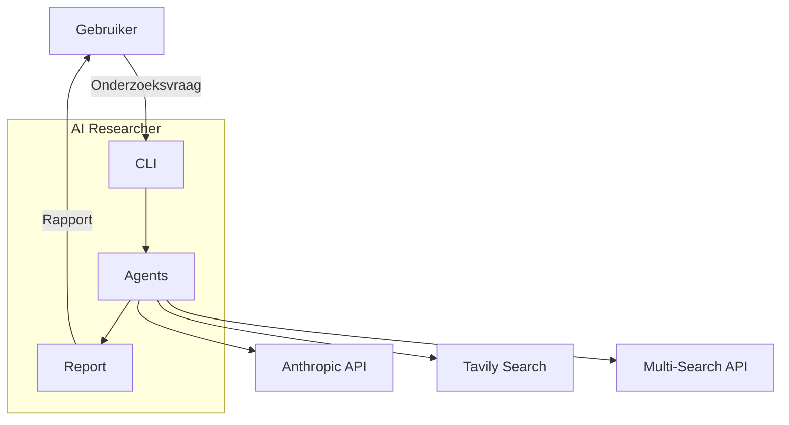

# 3. Context en Scope

## 3.1 Business Context

## 3.2 Externe Interfaces

| Interface | Beschrijving | Protocol |
|-----------|--------------|----------|
| **Anthropic API** | LLM inference (Claude) | HTTPS REST |
| **Tavily Search** | Web search met relevantie scoring | HTTPS REST |
| **Multi-Search API** | Aggregated search (DuckDuckGo, Google, etc.) | HTTPS REST |
| **Filesystem** | Rapport output, prompt templates | Local I/O |
| **Environment** | API keys via .env of shell | OS env vars |

## 3.3 Scope

### In Scope

- CLI-gebaseerd onderzoek
- Multi-agent orchestratie
- Hybrid search (meerdere providers)
- Gestructureerde rapportgeneratie
- Kostentracking per sessie
- Interactieve en batch modus

### Out of Scope

- Web UI of API server
- Real-time streaming naar externe systemen
- Multi-user of authenticatie
- Persistent storage (database)
- Scheduling/cron jobs
