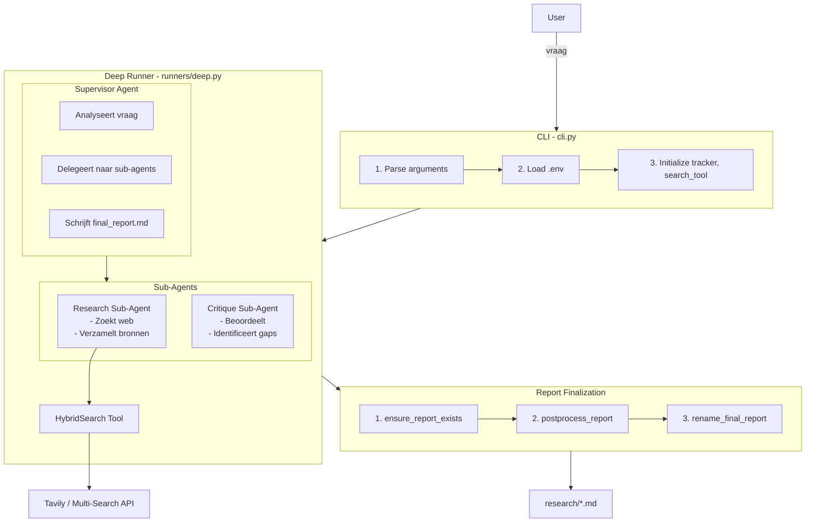
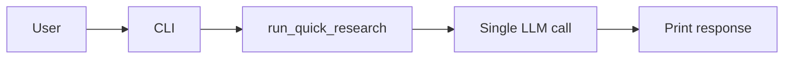
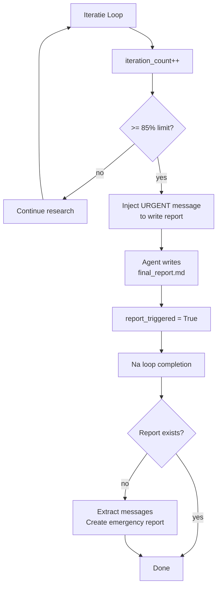
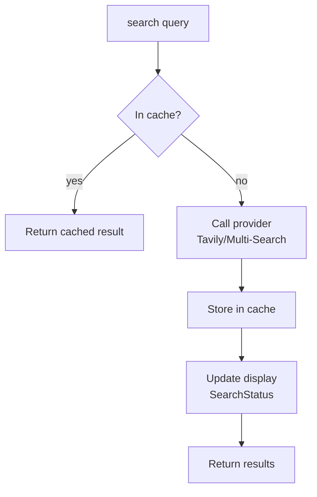
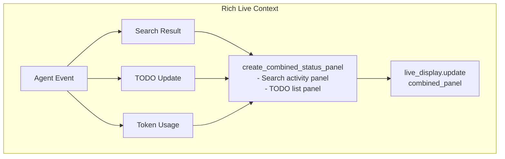

# 6. Runtime View

## 6.1 Deep Research Flow

## 6.2 Quick Research Flow

Simpele flow zonder sub-agents of rapport opslag.

## 6.3 Report Guarantee Mechanism

## 6.4 Search Flow met Caching

## 6.5 UI Update Cycle

