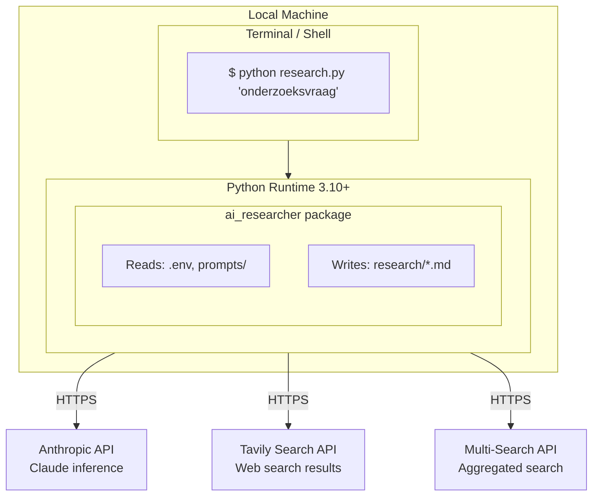

# 7. Deployment View

## 7.1 Infrastructuur Overzicht



## 7.2 Vereisten

### Hardware

| Component | Minimum | Aanbevolen |
|-----------|---------|------------|
| RAM | 2 GB | 4 GB |
| Disk | 100 MB | 500 MB (voor rapporten) |
| Network | Stabiele internetverbinding | Breedband |

### Software

| Component | Versie | Opmerkingen |
|-----------|--------|-------------|
| Python | 3.10+ | Type hints, match statements |
| pip | Recent | Voor dependencies |
| Terminal | UTF-8 support | Rich output |

### API Keys

```bash
# .env bestand
ANTHROPIC_API_KEY=sk-ant-...      # Verplicht
TAVILY_API_KEY=tvly-...           # Optioneel (voor Tavily search)
MULTI_SEARCH_API_KEY=...          # Optioneel (voor multi-search)
```

## 7.3 Installatie

```bash
# Clone repository
git clone https://github.com/user/ai-researcher.git
cd ai-researcher

# Installeer dependencies
pip install -r requirements.txt

# Configureer API keys
cp .env.example .env
# Edit .env met je API keys

# Verifieer installatie
python research.py --help
```

## 7.4 Directory Layout

```
ai-researcher/                  # Project root
├── research.py                 # Entry point
├── ai_researcher/              # Package code
├── prompts/                    # (legacy, nu in package)
├── research/                   # Output folder (auto-created)
│   ├── final_report.md        # Tijdelijk rapport (wordt hernoemd)
│   └── [slug]-[date].md       # Finale rapporten
├── tests/                      # Unit tests
├── docs/                       # Documentatie
├── .env                        # API keys (niet in git)
├── .env.example                # Template voor .env
└── requirements.txt            # Python dependencies
```

## 7.5 Uitvoering Modi

### Interactief

```bash
python research.py
# Vraagt om input, toont live progress
```

### Command Line

```bash
python research.py "Wat is quantum computing?" --deep
```

### Quick Mode

```bash
python research.py "Korte vraag" --quick
```

## 7.6 Output Locatie

Alle rapporten worden opgeslagen in `research/`:

```
research/
├── quantum-computing-2024-01-15.md
├── machine-learning-trends-2024-01-16.md
└── ...
```

Bestandsnaam formaat: `[slug-van-titel]-[YYYY-MM-DD].md`
