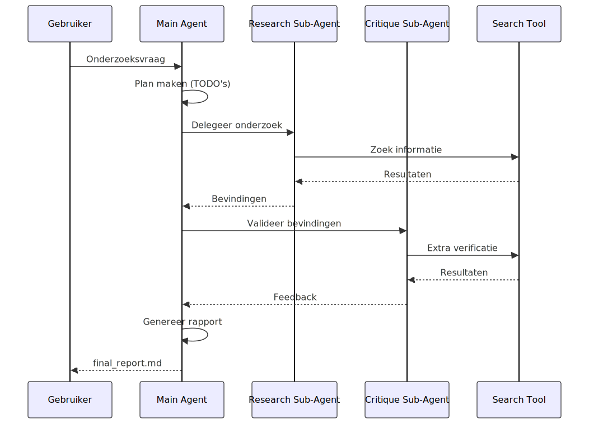

# AI Research Agent
### Intelligent onderzoeksassistent met DeepAgents

Een geavanceerde research agent die:
- ✅ Diepgaand onderzoek uitvoert
- ✅ Meerdere zoekbronnen gebruikt
- ✅ Automatisch kritiek en verificatie toepast
- ✅ Professionele rapporten genereert

---

## Systeemarchitectuur

<div style="text-align: center; margin: 10px auto;">
  
</div>

---

## Kerncomponenten

### 1. Main Agent
- Orkestreert het onderzoeksproces
- Beheert sub-agents
- Coördineert zoekacties
- Genereert eindrapport

### 2. Research Sub-Agent
- Voert gedetailleerd onderzoek uit
- Verzamelt informatie uit meerdere bronnen
- Synthetiseert bevindingen

---

## Kerncomponenten (vervolg)

### 3. Critique Sub-Agent
- Valideert onderzoeksresultaten
- Controleert op tegenstrijdigheden
- Vraagt om extra verificatie indien nodig
- Verbetert de kwaliteit

### 4. HybridSearchTool
- Ondersteunt meerdere providers
- Automatische fallback
- Usage tracking

---

## HybridSearchTool: Providers

### Drie beschikbare modes:

**1. Tavily** (Premium)
- AI-geoptimaliseerde resultaten
- Hoogste kwaliteit
- Betaalde API

**2. Multi-Search** (Gratis tier)
- Auto-fallback over Serper, SearXNG, Brave, Google Scraper
- Gratis quota
- Goede kwaliteit

**3. Auto** (Hybrid)
- Multi-Search eerst
- Tavily als fallback bij fouten

---

## Workflow Diagram

<div style="text-align: center; margin: 10px auto;">
  
</div>

---

## Rich Terminal UI

### Real-time Visualisatie

**Progress Tracking:**
- 🔍 Zoekopdrachten met provider info
- 💭 Agent redenering (preview)
- 🛠️ Tool aanroepen
- 🤖 Sub-agent activiteit

**TODO Display:**
- ○ Pending taken
- ▶ In progress (geel)
- ✓ Completed (groen)

---

## Rich Terminal UI (vervolg)

### Statistieken Panel

Na afloop wordt getoond:
- ⏱️ **Duur**: Totale executietijd
- 🔍 **Zoekopdrachten**: Aantal searches
- 💬 **Berichten**: Aantal agent messages
- 🌐 **Providers**: Gebruikte search providers

### Rapport Preview
- Eerste 500 karakters markdown preview
- Link naar volledig rapport

---

## Configuratie Opties

### Recursion Limit
- **Standaard**: 200 iteraties
- **Minimum**: 50 (voor sub-agents)
- **Maximum**: 500
- **Doel**: Voorkomt oneindige loops

**Waarom belangrijk?**
- Hoofdagent en sub-agents delen dit budget
- Complexe onderzoeken gebruiken meer iteraties
- Te laag = vroegtijdig stoppen
- Te hoog = mogelijk eindeloos runnen

---

## Configuratie Opties (vervolg)

### Provider Selectie
Bij opstarten kiest gebruiker:

1. **Tavily**: Premium, AI-optimized
2. **Multi-Search**: Gratis tier met auto-fallback
3. **Auto**: Intelligent kiezen

### Onderzoeksvraag
- Interactieve prompt
- Standaard voorbeeld beschikbaar
- Bevestiging voor start (kostenbewust!)

---

## Data Flow

<div style="text-align: center; margin: 10px auto;">
  
</div>

---

## Search Result Normalisatie

### Probleem
- Tavily en Multi-Search hebben verschillende response formats
- Agent verwacht consistent format

### Oplossing: `normalize_multi_search_response()`

Converteert Multi-Search → Tavily format:
- `snippet` → `content`
- `link` → `url`
- Voegt `score`, `_provider`, `_cache_hit` toe

**Resultaat**: Agent is provider-agnostisch

---

## Error Handling

### GraphRecursionError
Bij het bereiken van recursion limit:

**Gebruiksvriendelijke melding:**
- ❌ Recursion limit bereikt
- 💡 Mogelijke oorzaken
- 🔧 Suggestie: verhoog naar 300-500

**Voordelen:**
- Geen scary traceback
- Duidelijke actie voor gebruiker
- Educatief

---

## Error Handling (vervolg)

### Thread Safety
**Probleem:** Multi-Search cache + parallel sub-agents = crash

**Oplossing:**
```python
SmartSearchTool(
    enable_cache=False  # Thread safety
)
```

### KeyboardInterrupt
- Graceful shutdown
- Gebruiker kan onderzoek stoppen
- Netjes opruimen

---

## Agent Instrumentation

### AgentTracker Class
Houdt bij:
- `searches_count`: Aantal searches
- `messages_count`: Aantal berichten
- `current_todos`: Huidige TODO lijst
- `file_operations`: Bestandsacties

### Event Stream Monitoring
```python
for event in agent.stream(...):
    # Track TODO updates
    # Track model thinking
    # Track tool calls
    # Track sub-agent activity
```

---

## TODO Management

### DeepAgents Middleware
Agent beheert eigen taken via `write_todos` tool

**Structuur:**
```python
{
    "content": "Zoek naar XAI papers",
    "status": "in_progress",  # of pending/completed
}
```

### Display Logic
- Alleen tonen bij wijzigingen
- Visuele iconen (○, ▶, ✓)
- Kleurcodering
- Compact panel design

---

## Performance Optimizations

### 1. Compact Search Output
**Voor:**
```
Searching for: "Explainable AI"
8 resultaten gevonden
Provider: Serper
```

**Na:**
```
🔍 [#1] Explainable AI → 8 resultaten (Serper)
```

### 2. Cache Management
- Disabled voor thread safety
- Trade-off: stabiliteit > snelheid

---

## Performance Optimizations (vervolg)

### 3. Streaming
- Real-time updates via `agent.stream()`
- Gebruiker ziet vooruitgang
- Betere UX bij lange searches

### 4. Preview Limiting
- Agent thinking: 150 chars
- Query display: 60 chars
- Rapport preview: 500 chars

**Resultaat:** Geen terminal overflow

---

## Gebruik van het Systeem

### Stap 1: Start
```bash
python research.py
```

### Stap 2: Configureer
1. Recursion limit (default: 200)
2. Search provider (1/2/3)

### Stap 3: Vraag
- Voer onderzoeksvraag in
- Bevestig start

### Stap 4: Monitor
- Zie real-time progress
- TODO's
- Searches

---

## Output

### Terminal Output
- Live progress met Rich UI
- Kleurgecodeerde updates
- Statistieken panel

### File Output: `final_report.md`
- Markdown formatted
- Gestructureerd rapport
- Bronvermeldingen
- Conclusies en bevindingen

**Preview in terminal** + link naar volledig bestand

---

## Technische Stack

### Core Libraries
- **deepagents**: Agentic framework (LangChain-based)
- **tavily-python**: Premium search API
- **multi-search-api**: Free tier aggregator
- **rich**: Terminal UI
- **python-dotenv**: Environment vars

### Framework Features
- LangGraph voor agent orchestration
- Built-in planning middleware
- File system tools
- Sub-agent support

---

## Best Practices

### 1. Kostenmanagement
- ⚠️ Geen tests zonder toestemming
- Gebruik gratis tier voor development
- Monitor provider usage stats

### 2. Recursion Limits
- 50+ voor sub-agents
- 200 als veilige default
- 300-500 voor complexe vragen

### 3. Provider Selectie
- Multi-Search voor exploratie
- Tavily voor productie
- Auto voor best-of-both

---

## Best Practices (vervolg)

### 4. Error Handling
- Graceful degradation
- Clear user messages
- Logging van provider failures

### 5. Monitoring
- Track alle searches
- Display TODO's real-time
- Toon statistics

---

## Uitbreidingsmogelijkheden

### 1. Extra Providers
- DuckDuckGo
- Bing API
- Perplexity API

### 2. Meer Sub-Agents
- Fact-checker agent
- Summarization agent
- Citation agent

### 3. Output Formats
- PDF export
- HTML rapport
- JSON data

---

## Uitbreidingsmogelijkheden (vervolg)

### 4. Geavanceerde Features
- Web scraping voor deep-dive
- Document upload (RAG)
- Multi-language support
- Citation verification

### 5. Persistentie
- Conversation history
- Research session recovery
- Knowledge base building

---

## Security & Privacy

### API Keys
- Opslag in `.env` file
- Niet in version control
- Environment variables

### Rate Limiting
- Recursion limit voorkomt spam
- Provider quota's worden gerespecteerd

### Data Privacy
- Geen data logging
- Lokale opslag van rapporten
- User heeft volledige controle

---

## Troubleshooting

### Probleem: Recursion limit bereikt
**Oplossing:** Verhoog naar 300-500

### Probleem: Search provider faalt
**Oplossing:**
- Check API keys in `.env`
- Gebruik 'auto' mode
- Probeer andere provider

### Probleem: Lange executietijd
**Normale oorzaken:**
- Complexe vraag
- Veel sub-agent calls
- Grondige critique cycles

---

## Conclusie

### De AI Research Agent biedt:

✅ **Intelligent onderzoek** met planning en verificatie
✅ **Flexibele zoekopties** (gratis + premium)
✅ **Real-time visibility** via Rich UI
✅ **Robuuste error handling**
✅ **Kostencontrole** met configureerbare limits
✅ **Professionele output** in Markdown

**Perfect voor:** Literature reviews, marktonderzoek, technische research, fact-checking

---

# Demo Time! 🚀

### Live demonstratie van:
1. Agent configuratie
2. Onderzoeksvraag invoeren
3. Real-time monitoring
4. Rapport generatie

---

# Vragen?

### Contact & Documentatie
- Code: `/Users/joopsnijder/Projects/ai-researcher/`
- Main file: `research.py`
- Requirements: `requirements.txt`

### Belangrijke files:
- `.env` - API configuratie
- `final_report.md` - Output rapport
- `docs/` - Documentatie

**Bedankt voor je aandacht!**
